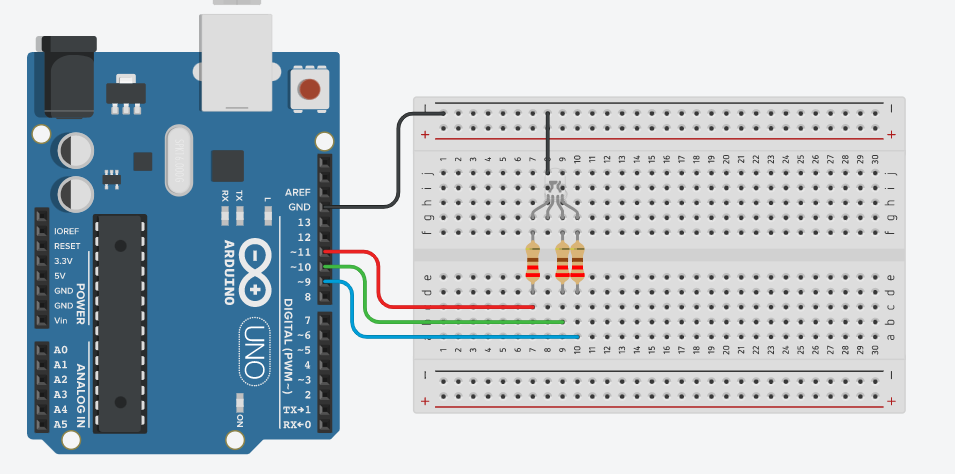

# Projeto Arduíno para piscar o led incorporado v1.

## Contextualização

-Neste experimento você irá fazer com que um LED RGB controlado pelas portas digitais 9, 10 e 11
(PMW) acendam de forma intermitente. O LED RGB possui 3 LEDs em seu interior, onde o pino 9
controla o LED vermelho, 10 controla o LED azul e o 11 controla o verde. O brilho de cada LED é
controlado atribuindo um valor entre 0 e 255. 

## Esquema do projeto

